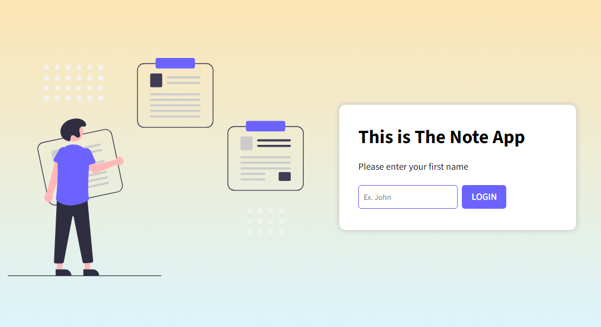

# Note App
## [Live Preview](https://the-note-app.onrender.com/login)


## Requirements:

1. Ask the user for a first name
2. Display a **"Welcome username"** message
3. Save the name to the locally.
4. Redirect to the homepage.
5. Home page features:
   - Add a note.
   - View all notes.
   - Search.
6. The notes should be saved inside a file.
7. Built on **Flask**.
8. Commit to Git **regularly**.

## Brainstorming:

- multiple users, separate notes.
- sessions.
- user can login again to see the notes.
- The notes are cards.
- You can search the notes.
- You can add new note.
- The cards has random colors.
- The card has timestamp.
- You can delete the cards individually.


## Logic:

#### First Step:

```python
if no user in session:
  show form to enter name
else:
  1. redirect to welcome page
  2. redirect to homepage after 2 seconds
```

#### Second Step:

```python
if there is a note file with the user name:
  1. retrieve notes from file
  2. put the notes inside an array
  3. display them on homepage
else:
  create a new file with the user name
```

#### Add Note:

```python
1. show the add note form on button click.
2. submit the form with "post" method  and write to file then rerender the new list
```

#### Search:

```python
1. submit the search form to the results page
2. use find() to search existing note for the search parameter
3. display the results on screen
```

#### Delete Note:

```python
1. get the note index from the card
2. send the index through form post method
2. delete the note from the notes array[index]
3. rerender the notes from the updated array
4. rewrite the file
```

#### Log Out:

```python
allow the user to log out by clearing the session but not the notes file
```
